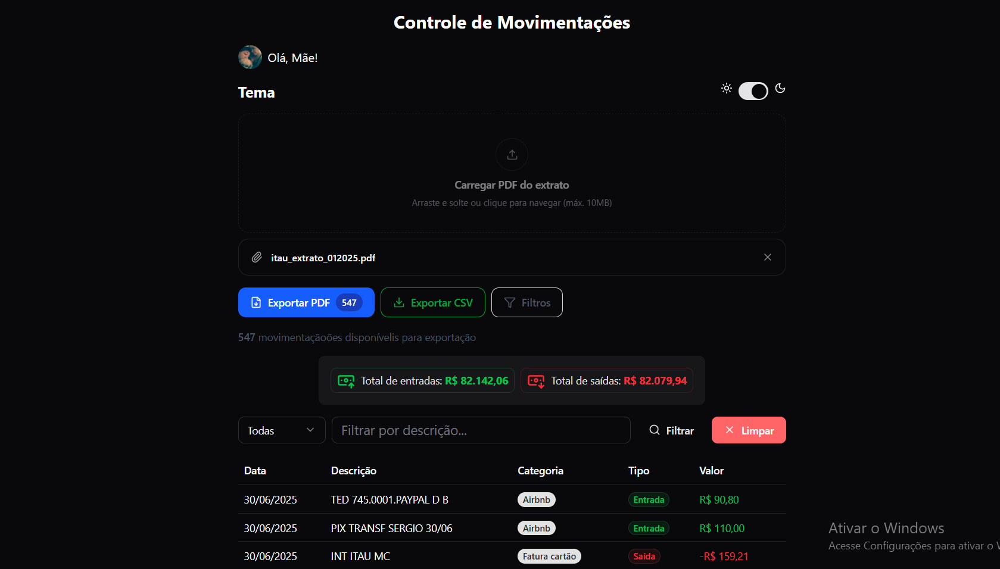

# 🏦 Bank Extract - Controle de Movimentações Bancárias

[](https://github.com/seu-usuario/bank-extract)
[](https://github.com/SrDev-Henrique/Bank-Extract)
[](https://nodejs.org/)
[](https://nextjs.org/)
[](https://www.typescriptlang.org/)

**Aplicação web moderna para análise, controle e exportação de movimentações bancárias através do upload e processamento de extratos em PDF.**

O Bank Extract resolve o problema de controle financeiro manual ao automatizar a extração de dados de extratos bancários, oferecendo visualização organizada, filtros inteligentes e funcionalidades avançadas de exportação em PDF e CSV com formatação brasileira.



## 🧭 Sumário

- [Quick Start](#-quick-start)
- [Funcionalidades](#-funcionalidades)
- [Pré-requisitos](#-pré-requisitos)
- [Instalação](#-instalação)
- [Uso](#-uso)
- [Configuração](#-configuração)
- [Scripts Disponíveis](#-scripts-disponíveis)
- [Testes](#-testes)
- [Deploy](#-deploy)
- [Tecnologias](#-tecnologias)
- [Estrutura do Projeto](#-estrutura-do-projeto)
- [Exportação PDF/CSV](#-exportação-pdfcsv)
- [CI/CD](#-cicd)
- [Contribuição](#-contribuição)
- [Troubleshooting](#-troubleshooting)
- [Changelog](#-changelog)
- [Licença](#-licença)
- [Contato](#-contato)

## 🚀 Quick Start

```bash
# Clone o repositório
git clone https://github.com/SrDev-Henrique/bank-extract.git
cd bank-extract

# Instale as dependências
npm install

# Execute em desenvolvimento
npm run dev

# Acesse em http://localhost:3000
```

## ✨ Funcionalidades

### 🔄 **Upload e Processamento de PDF**

- Upload por drag & drop ou seleção de arquivo
- Processamento automático de extratos bancários em PDF
- Validação de formato e tamanho (máx. 10MB)
- Feedback visual durante o processamento

### 📊 **Visualização de Dados**

- Tabela responsiva com movimentações
- Categorização automática (Entrada/Saída)
- Formatação monetária em Real (BRL)
- Paginação para grandes volumes de dados (15 itens por página)

### 🔍 **Filtros e Busca**

- Filtro por descrição das movimentações
- Busca case-insensitive
- Botão de limpeza rápida do filtro

### 📈 **Totalizadores**

- Cálculo automático de total de entradas
- Cálculo automático de total de saídas
- Indicadores visuais com ícones e cores

### 📄 **Exportação Avançada**

- **Exportação em PDF** com formatação brasileira
- **Exportação em CSV** para análise externa
- Filtros por tipo (entrada/saída) e período
- Múltiplas páginas com cabeçalho repetido
- Totais calculados automaticamente

### 🎨 **Interface e Tema**

- Tema claro e escuro
- Switch de tema com persistência no localStorage
- Detecção automática da preferência do sistema
- Interface responsiva e moderna

## 📋 Pré-requisitos

- **Node.js** 18.0.0 ou superior
- **npm** / **yarn** / **pnpm**
- Navegador moderno com suporte a ES6+

## 🔧 Instalação

### 1. Clone o repositório

```bash
git clone https://github.com/SrDev-Henrique/bank-extract.git
cd bank-extract
```

### 2. Instale as dependências

```bash
# npm
npm install

# yarn
yarn install

# pnpm
pnpm install
```

### 3. Execute o projeto

```bash
# Desenvolvimento
npm run dev

# Build para produção
npm run build

# Produção
npm run start
```

### 4. Acesse a aplicação

```
http://localhost:3000
```

## 📖 Uso

### 1️⃣ **Upload do Extrato**

```typescript
// Exemplo de uso do componente de upload
import FileUpload from "@/components/file-upload";

function App() {
  return (
    <FileUpload
      onFileProcessed={(movimentacoes) => {
        console.log("Movimentações extraídas:", movimentacoes);
      }}
      maxSize={10 * 1024 * 1024} // 10MB
    />
  );
}
```

### 2️⃣ **Exportação de PDF/CSV**

```typescript
// Exemplo de uso do componente de exportação
import ExportMovsPdf from "@/components/ExportMovsPdf";

function RelatoriePage() {
  const movimentacoes = [
    {
      id: 1,
      data: new Date("2024-01-15"),
      descricao: "Salário Janeiro",
      valor: 5000.0,
      tipo: "entrada",
      categoria: "Salário",
    },
  ];

  return (
    <ExportMovsPdf
      movimentacoes={movimentacoes}
      title="Relatório Mensal"
      showFilters={true}
      showCsvOption={true}
    />
  );
}
```

### 3️⃣ **Filtros e Visualização**

1. Digite no campo "Filtrar por descrição..."
2. Clique em "Filtrar" ou pressione Enter
3. Use "Limpar" para remover o filtro
4. Navigate entre páginas quando há muitas movimentações

### 4️⃣ **Controle de Tema**

- Use o switch no canto superior direito
- ☀️ Tema claro / 🌙 Tema escuro
- A preferência é salva automaticamente

## ⚙️ Configuração

### Variáveis de Ambiente

Crie um arquivo `.env.local` na raiz do projeto:

```env
# Exemplo de configuração (.env.example)
# Copie para .env.local e configure os valores

# URL base da aplicação
NEXT_PUBLIC_APP_URL=http://localhost:3000

# Configurações de upload
NEXT_PUBLIC_MAX_FILE_SIZE=10485760

# Configurações de paginação
NEXT_PUBLIC_ITEMS_PER_PAGE=15

# Ambiente
NODE_ENV=development
```

| Variável                     | Descrição                         | Exemplo                      | Obrigatória |
| ---------------------------- | --------------------------------- | ---------------------------- | ----------- |
| `NEXT_PUBLIC_APP_URL`        | URL base da aplicação             | `http://localhost:3000`      | ❌          |
| `NEXT_PUBLIC_MAX_FILE_SIZE`  | Tamanho máximo do arquivo (bytes) | `10485760` (10MB)            | ❌          |
| `NEXT_PUBLIC_ITEMS_PER_PAGE` | Itens por página                  | `15`                         | ❌          |
| `NODE_ENV`                   | Ambiente de execução              | `development` / `production` | ❌          |

## 📜 Scripts Disponíveis

```bash
# Desenvolvimento com Turbopack (mais rápido)
npm run dev

# Build para produção
npm run build

# Executar servidor de produção
npm run start

# Linter (ESLint)
npm run lint

# Verificar tipos TypeScript
npx tsc --noEmit

# Limpar cache do Next.js
npx next clean
```

## 🧪 Testes

```bash
# Executar testes (quando implementados)
npm run test

# Testes em modo watch
npm run test:watch

# Cobertura de testes
npm run test:coverage

# Testes E2E (quando implementados)
npm run test:e2e
```

> **📝 Nota**: Testes unitários e E2E serão implementados em versões futuras.

## 🚀 Deploy

### Vercel (Recomendado)

```bash
# Instalar Vercel CLI
npm i -g vercel

# Deploy
vercel

# Deploy para produção
vercel --prod
```

### Docker

```dockerfile
# Dockerfile
FROM node:18-alpine AS base

# Instalar dependências apenas quando necessário
FROM base AS deps
WORKDIR /app
COPY package.json package-lock.json* ./
RUN npm ci

# Build da aplicação
FROM base AS builder
WORKDIR /app
COPY --from=deps /app/node_modules ./node_modules
COPY . .
RUN npm run build

# Imagem de produção
FROM base AS runner
WORKDIR /app

ENV NODE_ENV production

RUN addgroup --system --gid 1001 nodejs
RUN adduser --system --uid 1001 nextjs

COPY --from=builder /app/public ./public
COPY --from=builder --chown=nextjs:nodejs /app/.next/standalone ./
COPY --from=builder --chown=nextjs:nodejs /app/.next/static ./.next/static

USER nextjs

EXPOSE 3000
ENV PORT 3000

CMD ["node", "server.js"]
```

```yaml
# docker-compose.yml
version: "3.8"
services:
  bank-extract:
    build: .
    ports:
      - "3000:3000"
    environment:
      - NODE_ENV=production
    restart: unless-stopped
```

### Outras Plataformas

- **Netlify**: Conecte o repositório GitHub
- **Railway**: `railway deploy`
- **Render**: Conecte o repositório e configure build command `npm run build`

## 🛠️ Tecnologias

### **Frontend**

- **Next.js 15.4.3** - Framework React com App Router
- **React 19.1.0** - Biblioteca para interfaces de usuário
- **TypeScript 5** - Superset tipado do JavaScript
- **Tailwind CSS 4** - Framework CSS utilitário

### **UI/UX**

- **Radix UI** - Componentes primitivos acessíveis
- **Lucide React** - Biblioteca de ícones moderna
- **React Aria Components** - Componentes acessíveis

### **Processamento e Exportação**

- **PDF.js (pdfjs-dist)** - Biblioteca para parsing de PDF
- **jsPDF + jsPDF-AutoTable** - Geração de PDFs no client-side
- **React Hook Form** - Gerenciamento de formulários
- **Zod** - Validação de esquemas TypeScript

### **Estilização**

- **Class Variance Authority** - Gerenciamento de variantes CSS
- **clsx/classnames** - Utilitários para classes condicionais
- **tailwind-merge** - Merge inteligente de classes Tailwind

## 📁 Estrutura do Projeto

```
src/
├── app/                    # App Router do Next.js
│   ├── globals.css        # Estilos globais e variáveis CSS
│   ├── layout.tsx         # Layout principal da aplicação
│   └── page.tsx           # Página inicial
├── components/            # Componentes React
│   ├── ui/               # Componentes base (Button, Input, etc.)
│   ├── OriginUI/         # Componentes especializados
│   ├── ExportMovsPdf.tsx # Componente de exportação PDF/CSV
│   ├── home.tsx          # Componente principal da aplicação
│   ├── movs.tsx          # Tabela de movimentações
│   ├── movs-filter.tsx   # Filtro de movimentações
│   ├── total.tsx         # Totalizadores
│   └── loading.tsx       # Componente de loading
├── hooks/                # Custom hooks
│   ├── use-file-upload.ts # Hook para upload de arquivos
│   └── use-pagination.ts  # Hook para paginação
├── types/                # Definições TypeScript
│   └── types.ts          # Interfaces e tipos
├── utils/                # Utilitários
│   ├── parsePdf.ts       # Parser de PDF para extratos
│   └── exportMovsToPdf.ts # Utilitários de exportação
└── lib/                  # Bibliotecas e configurações
    ├── utils.ts          # Utilitários gerais
    └── text.ts           # Utilitários de texto
```

## 📄 Exportação PDF/CSV

### Funcionalidades da Exportação

- **Formatação Brasileira**: Datas no formato `dd/mm/yyyy` e valores em `R$ 0.000,00`
- **Múltiplas Páginas**: Suporte automático com cabeçalho repetido
- **Filtros Avançados**: Por tipo de movimentação e período
- **Totalizadores**: Cálculo automático de entradas, saídas e saldo
- **CSV Export**: Alternativa para análise em planilhas

### Exemplo de Uso Programático

```typescript
import { exportMovsToPdf, exportMovsToCSV } from "@/utils/exportMovsToPdf";

// Exportar PDF com filtros
await exportMovsToPdf(movimentacoes, {
  title: "Relatório Mensal",
  filename: "relatorio_janeiro_2024.pdf",
  filterType: "entrada", // apenas entradas
  dateRange: {
    start: new Date("2024-01-01"),
    end: new Date("2024-01-31"),
  },
});

// Exportar CSV
exportMovsToCSV(movimentacoes, {
  filename: "movimentacoes.csv",
  filterType: "saida", // apenas saídas
});
```

Consulte a [documentação completa de exportação](./EXPORT_MOVS_PDF_README.md) para mais detalhes.

## 🔄 CI/CD

### GitHub Actions (Exemplo)

```yaml
# .github/workflows/ci.yml
name: CI/CD

on:
  push:
    branches: [main, develop]
  pull_request:
    branches: [main]

jobs:
  test:
    runs-on: ubuntu-latest
    steps:
      - uses: actions/checkout@v4
      - uses: actions/setup-node@v4
        with:
          node-version: "18"
          cache: "npm"

      - run: npm ci
      - run: npm run lint
      - run: npm run build
      - run: npm run test # quando implementado

  deploy:
    needs: test
    runs-on: ubuntu-latest
    if: github.ref == 'refs/heads/main'
    steps:
      - uses: actions/checkout@v4
      - uses: amondnet/vercel-action@v20
        with:
          vercel-token: ${{ secrets.VERCEL_TOKEN }}
          vercel-org-id: ${{ secrets.ORG_ID }}
          vercel-project-id: ${{ secrets.PROJECT_ID }}
          vercel-args: "--prod"
```

## 🤝 Contribuição

### Como Contribuir

1. **Fork** o projeto
2. Crie uma **branch** para sua feature (`git checkout -b feature/nova-feature`)
3. **Commit** suas mudanças (`git commit -m 'feat: adiciona nova feature'`)
4. **Push** para a branch (`git push origin feature/nova-feature`)
5. Abra um **Pull Request**

### Padrão de Commits

Utilizamos [Conventional Commits](https://www.conventionalcommits.org/):

```
feat: adiciona nova funcionalidade
fix: corrige bug
docs: atualiza documentação
style: mudanças de formatação
refactor: refatoração de código
test: adiciona ou corrige testes
chore: mudanças de configuração
```

### Issues e Pull Requests

- **Issues**: Use os templates disponíveis para reportar bugs ou solicitar features
- **Pull Requests**: Inclua descrição detalhada e teste suas mudanças
- **Code Review**: Pelo menos uma aprovação é necessária

### Código de Conduta

Este projeto adere ao [Contributor Covenant](https://www.contributor-covenant.org/). Esperamos que todos os participantes sigam o código de conduta para manter um ambiente acolhedor e inclusivo.

## ❓ Troubleshooting

### Problemas Comuns

**1. Erro ao processar PDF**

```
Solução: Verifique se o PDF segue o formato esperado:
- Seção com cabeçalho "Data Lançamentos Valor"
- Linhas no formato: DD/MM/AAAA DESCRIÇÃO VALOR
```

**2. Arquivo muito grande**

```
Solução: O limite é de 10MB. Comprima o PDF ou divida em partes menores.
```

**3. Movimentações não aparecem**

```
Solução: Verifique se:
- O PDF contém dados de movimentação
- O formato das datas está correto (DD/MM/AAAA)
- Os valores estão no formato brasileiro (1.234,56)
```

**4. Erro de build**

```bash
# Limpe o cache e reinstale
rm -rf .next node_modules package-lock.json
npm install
npm run build
```

**5. Problemas de tipo TypeScript**

```bash
# Verifique tipos
npx tsc --noEmit
```

### Logs e Debug

```javascript
// Ativar logs detalhados
localStorage.setItem("debug", "bank-extract:*");

// Verificar dados processados
console.log("Movimentações:", JSON.stringify(movimentacoes, null, 2));
```

## 📝 Changelog

### [0.1.0] - 2024-01-15

#### Adicionado

- ✨ Upload e processamento de extratos PDF
- 📊 Visualização em tabela responsiva
- 🔍 Sistema de filtros por descrição
- 📈 Totalizadores automáticos
- 🎨 Tema claro/escuro
- 📄 Exportação em PDF e CSV
- 🔧 Filtros avançados por tipo e período
- 📱 Interface responsiva

#### Tecnologias

- ⚡ Next.js 15.4.3 com Turbopack
- 🎨 Tailwind CSS 4
- 📝 TypeScript 5
- 🔒 Componentes acessíveis (Radix UI)

### Formato para Próximas Versões

```markdown
### [Unreleased]

#### Adicionado

#### Alterado

#### Corrigido

#### Removido
```

## 📞 Contato

**👨‍💻 Desenvolvedor**: Henrique Albuquerque  
**📧 Email**: halbuquerque2850@gmail.com  
**🌐 Demo**: [henrique-bank-extract.vercel.app](https://henrique-bank-extract.vercel.app/)  
**💼 GitHub**: [@SrDev-Henrique](https://github.com/SrDev-Henrique)

---

<div align="center">

**⭐ Se este projeto foi útil, considere dar uma estrela!**

[](https://github.com/seu-usuario/bank-extract)

</div>
